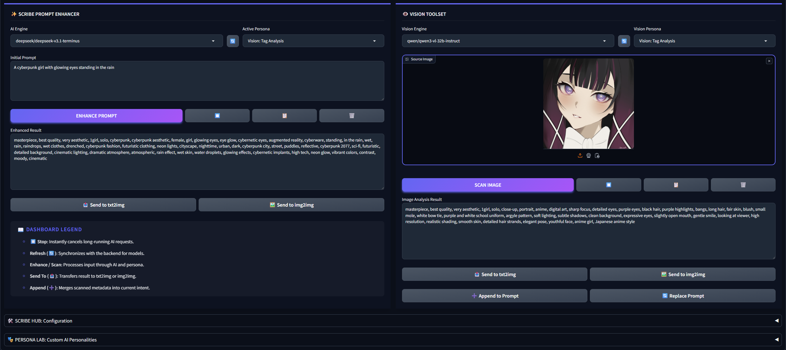

> [!IMPORTANT]
> **ScribeNEO** was originally developed by **[SiliconeShojo](https://github.com/SiliconeShojo)**.
> 
> The original GitHub repository was deleted by SiliconeShojo. This repository was restored from a local clone of the original repository to preserve the project and keep it available for continued use.
> 
> This is a restoration of the original repository and is not a claim of original authorship. The original Git history and MIT License have been preserved.
> 
> The restored repository contains the original history up to commit `9b281e5` (`Fix compatibility issue with WD14-Tagger. Fixes #6`). Any changes made after the restoration will be clearly reflected in the commit history.

# 🖋️ ScribeNEO

A prompt engineering extension for Stable Diffusion Forge Neo. Enhance text prompts with AI, interrogate images with vision models, and manage custom personas — all from a single dashboard.

> [!IMPORTANT]
> **Compatibility:**
> Built and tested exclusively on [Forge Neo](https://github.com/Haoming02/sd-webui-forge-classic/tree/neo). Compatibility with other Forge forks is not guaranteed.

---

## ✨ Features

### ✍️ Prompt Enhancer
Type a rough idea, pick a persona, and let an LLM transform it into a detailed generation-ready prompt.
- **Prose Enhancer**: Expands keywords into rich, natural language descriptions.
- **Tag Specialist**: Converts ideas into Danbooru/e621 tag sequences.
- Results can be sent directly to **txt2img** or **img2img**.

### 👁️ Vision Toolset
Upload an image and scan it with a vision-capable model to extract prompts from existing artwork.
- **Descriptive Caption**: Outputs a detailed prose description of the image.
- **Tag Analysis**: Outputs a structured booru-style tag list.
- Results can be **appended** to or **replaced** in the enhancer input.

### 🎭 Persona Management
Create, edit, and delete custom system prompts that shape how the AI interprets your intent. Four personas are included out of the box.

### ⚙️ Settings & Configuration
Central configuration panel for managing provider connections.
- **Multi-Provider Support**: Switch between **OpenRouter**, **Hugging Face**, **Ollama**, and **LM Studio** backend engines.
- **VRAM Model Unloader**: Select and instantly unload active models from local VRAM for both **Ollama** and **LM Studio** backends.
- **Request Timeout**: Specify the maximum duration allowed for backend network requests.
- **Max Output Tokens**: Set an upper limit on the length of the generated model responses.
- **Diagnostics**: Test connections, save authentication keys, and configure custom endpoint URLs.
- **Model Synchronization**: Query and sync available models dynamically from the active provider.

---

## 🚀 Installation

1. Open your **Stable Diffusion WebUI** (Forge Neo).
2. Navigate to the **Extensions** tab → **Install from URL**.
3. Paste: `https://github.com/SiliconeShojo/ScribeNEO.git`
4. Click **Install** and restart the WebUI.

---

## 🗝️ Getting API Keys

| Provider | How to get a key |
|---|---|
| **OpenRouter** | Create an account and generate a key at [openrouter.ai/keys](https://openrouter.ai/keys). Gives access to Gemini, Claude, GPT-4o, and more. |
| **Hugging Face** | Generate an Access Token (read permissions) at [huggingface.co/settings/tokens](https://huggingface.co/settings/tokens). |
| **Ollama** | No key needed. Just run the Ollama server locally. |
| **LM Studio** | No key needed. Just run the LM Studio server locally. |

---

## 📋 Changelog

<b>Click to expand changelog history</b>

### [1.2.0] - 2026-05-21
#### Added
- **LM Studio Integration**: Added support for LM Studio as a first-class service provider backend for prompt enhancement (text LLMs) and image scanning (vision models).
- **Asynchronous Request Layer**: Migrated backend HTTP request operations from synchronous `requests` to asynchronous `httpx` to support concurrent operations and network-level request cancellation.
- **Instant Request Cancellation**: Introduced functional stop buttons (`🛑`) that abort active LLM generation or image scanning requests on the network/socket level instantly.
- **Configurable Request Timeout**: Added a global "Request Timeout" setting to allow users to customize maximum API wait times before a connection aborts.
- **Configurable Max Output Tokens**: Added a global "Max Output Tokens" slider to constrain generated output lengths for both text and vision models.

### [1.1.0] - 2026-05-20
#### Added
- **Native Ollama API Integration**: Migrated all Ollama calls from the OpenAI API compatibility shim to native `/api/chat` and `/api/generate` endpoints. Special thanks to [@hirorohi03](https://github.com/hirorohi03) for suggesting this improvement!
- **Ollama VRAM Model Unloading**: Added an "Unload" button and model selection manager to instantly release active models from GPU VRAM. Special thanks to [@hirorohi03](https://github.com/hirorohi03) for the recommendation!
- **Configurable Keep-Alive**: Added a customizable "Keep-Alive" numeric setting (in seconds) next to the model unloader to control how long models remain loaded in memory. Special thanks to [@hirorohi03](https://github.com/hirorohi03) for the recommendation!
- **Bypass Vision Filters**: Added a "Show all models (bypass vision filter)" checkbox in the Vision Toolset to query Ollama models manually even if they aren't on the predefined vision model list.
- **Expanded Vision Models**: Included broader default support for Ollama vision models (`qwen`, `gemma`, `vl`, `vision`, `minicpm`, `paligemma`).
- **Schema-Based Persona Management**: Removed legacy name prefixes (`Scribe: ` and `Vision: `) from the `personas.json` file, replacing them with a structured `"type"` attribute (`scribe` vs. `vision`) for cleaner database separation.
- **Automatic Persona Database Migration**: Added startup logic that automatically migrates legacy name prefix schemas to the new type-based database format.
- **Persona Lab Category Toggle**: Integrated a compact **Category** selector control inside the Persona Lab UI to separate Prompt Enhancer and Vision personas during editing.
- **Ollama Vision Persona Support**: Rewrote local Ollama image interrogation to use the native `/api/chat` endpoint, adding full support for custom Vision system prompts and personas.
#### Fixed
- **Vision Query Error Handling**: Added graceful HTTP 400 interception. If a text-only model is interrogated with an image, the system now returns a helpful capability suggestion instead of throwing an unhandled exception.

---

## ☕ Support ScribeNEO

If ScribeNEO has enhanced your creative workflow, consider supporting its development!

---
*Made with 🤍 for the AI Art Community.*
